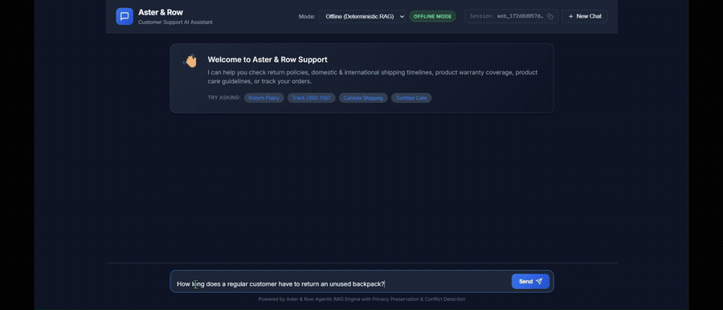

# Aster & Row: Reliable RAG Customer Support Agent

An engineering implementation of a reliable, privacy-safe, metadata-driven customer support AI agent for Aster & Row. 

The system provides:
- **Reliable RAG customer support**: Answers store policy and product questions grounded strictly in official documentation.
- **Privacy-safe order lookup**: Strips customer PII and sensitive internal fields at the Python tool boundary before prompt context assembly.
- **Metadata and authority-aware retrieval**: Distinguishes active official policies from superseded legacy policies and unapproved draft notes.
- **Multi-turn conversation handling**: Retains contextual memory, isolates sessions, and resolves order entity references across dialogue turns.
- **Deterministic active-source conflict detection**: Automatically identifies contradictions between active official documents and enforces conservative interim guidance with human specialist handoff.
- **Human specialist handoff**: Intelligently escalates order exceptions, operational requests, and knowledge conflicts.
- **Prompt-injection defense & data-instruction separation**: Treats retrieved knowledge base chunks and user queries strictly as untrusted data within XML boundaries.
- **Dual-interface access**: Modern, responsive Web GUI and an interactive technical CLI.
- **Gemini 3.6 Flash for live generation**: Uses Google's native Gemini 3.6 Flash REST API with structured JSON output.
- **Deterministic offline mode**: Fully testable and runnable offline with 100% test repeatability and zero external API dependencies.

---

## 1. Setup and Installation

### Prerequisites
- Python 3.10+ (Tested on Python 3.12)
- Git

### Installation from a Clean Clone
```bash
# 1. Clone the repository
git clone <repository-url>
cd ai-agent-intern-test

# 2. Create and activate a virtual environment
python -m venv .venv

# On Windows:
.venv\Scripts\activate
# On Linux/macOS:
source .venv/bin/activate

# 3. Install declared dependencies
pip install -r requirements.txt
```

### Running the Web GUI (Primary User Interface)
```bash
python -m src.web.main --port 8000
```
Open your browser and navigate to:
```
http://127.0.0.1:8000
```
> **Note**: **Offline mode is the default** and does not require an API key or network connection. It makes zero external LLM calls.

### Running the Interactive CLI
The CLI exposes the same `SupportAgent` backend and is intended for technical execution, script integration, and observability debugging:
```bash
# Interactive chat session (offline deterministic mode by default)
python -m src.cli.main

# Interactive chat with complete debug observability trace enabled
python -m src.cli.main --debug

# Run a single query directly with full trace inspection
python -m src.cli.main "Can I put the entire Breeze Tumbler in the dishwasher?" --debug

# Run in live Gemini mode
python -m src.cli.main --live --debug
```

---

## 2. Gemini Live Configuration

To enable live LLM generation with Google AI Studio, copy `.env.example` to `.env` and configure your credentials:

```bash
cp .env.example .env
```

### Environment Variables (`.env` / `.env.example`)
```env
# Gemini Live LLM Provider Configuration
LLM_PROVIDER=gemini
GEMINI_API_KEY=
GEMINI_BASE_URL=https://generativelanguage.googleapis.com/v1beta
GEMINI_MODEL=gemini-3.6-flash

# Agent runtime settings
DEBUG_MODE=false
MAX_RETRIEVED_CHUNKS=6
```

- **Automatic `.env` Discovery**: The application automatically loads `.env` from the project root at startup using `python-dotenv`.
- **Live Mode**: When `GEMINI_API_KEY` is configured, pass `--live` to the CLI (`python -m src.cli.main --live`) or select **Live Gemini LLM** from the Web GUI header dropdown. The transport connects directly to the native Gemini REST endpoint (`https://generativelanguage.googleapis.com/v1beta/models/gemini-3.6-flash:generateContent`).
- **Offline Mode**: If `GEMINI_API_KEY` is omitted or when offline mode is active, the agent runs entirely locally using its deterministic mock engine.
- **Security**: The `.env` file is untracked and excluded from version control via `.gitignore`. Never commit API keys.

---

## 3. Technology Choices & Design Rationale

| Layer | Technology Choice | Rationale |
|---|---|---|
| **Live LLM** | Google Gemini 3.6 Flash | Fast, low-latency, structured JSON output (`responseMimeType="application/json"`) via native Gemini REST API. |
| **Offline Engine** | Deterministic RAG Mock Engine | Fully reproducible local testing and evaluation with zero external API latency, rate limits, or costs. |
| **Retriever** | `InMemoryBM25Retriever` (`BaseRetriever` interface) | High-precision section-level BM25F with field weighting (headings $\times 3.5$, title $\times 2.0$, body $\times 1.0$), coordination factors, and domain boosts. |
| **Document Parser** | Markdown + YAML Frontmatter Parser | Extracts YAML metadata (`status`, `policy_authority`, `effective_date`) for pre-retrieval authority filtering. |
| **Data Tool** | `OrderLookupTool` (`orders.json`) | In-memory lookup enforcing customer-safe views (`CustomerSafeOrderView`), status precedence, and privacy boundaries. |
| **Web Backend** | FastAPI + Uvicorn | Lightweight ASGI web framework and server with automated request validation. |
| **Web Frontend** | Vanilla HTML5 / CSS3 / JavaScript | Dependency-free, fast, responsive single-page interface with zero build pipeline bloat. |
| **Validation & Schemas** | Pydantic v2 | Typed schemas, validation, and structured data contracts. |
| **Testing & Eval** | Pytest + Custom Evaluator | Automated test runner with semantic concept clustering, synonym normalization, and negative refusal assertions. |
| **CLI Formatting** | Rich | Clean terminal formatting with color-coded badges, panels, and collapsible debug trees. |

### Why No External Vector Database?
The Aster & Row knowledge base consists of **14 curated Markdown policy and product documents (~20 KB total)**. 
- The entire corpus fits comfortably in memory, allowing sub-millisecond lexical scoring without external vector database infrastructure (such as Pinecone, Qdrant, or Chroma).
- In-memory BM25 with metadata pre-filtering performs reliably for the current curated corpus evaluation, providing fast, deterministic, and self-contained retrieval.
- The retriever is decoupled behind a modular `BaseRetriever` abstract interface, allowing dense semantic embeddings or hybrid Reciprocal Rank Fusion (RRF) to be plugged in seamlessly if future enterprise scaling requires it.

---

## 4. Architecture & System Data Flow

The system provides a unified backend (`SupportAgent`) accessible across the Web GUI, the CLI, and the automated evaluation runner:

```
    ┌───────────────────────────────────────────────────────────┐
    │          User Interfaces & Evaluation Channels            │
    │      [ Web GUI (FastAPI) ]   [ CLI ]   [ Eval Runner ]    │
    └─────────────────────────────┬─────────────────────────────┘
                                  │
                                  ▼
                    [ Multi-Turn Session Manager ]
                    - Session isolation by session_id
                    - Active order follow-up routing
                                  │
                  ┌───────────────┴───────────────┐
                  ▼                               ▼
      [ OrderLookupTool ]             [ BaseRetriever ]
      - orders.json snapshot          - InMemoryBM25Retriever
      - Strip customer PII            - Active official filter
      - Strip internal notes          - Heading & field BM25F
      - Status precedence             - Metadata precedence
                  │                               │
                  └───────────────┬───────────────┘
                                  ▼
                  [ ConflictDetector (Pre-LLM) ]
                  - Detects conflicting active guidance
                                  │
                                  ▼
                  [ Prompt & Guardrail Assembly ]
                  - XML untrusted data boundaries
                  - Strict data-instruction separation
                  - Structured schema instructions
                                  │
                                  ▼
                  [ Generation Layer ]
                  - Live: Native Gemini 3.6 Flash REST
                  - Offline: Deterministic Mock Engine
                                  │
                                  ▼
                  [ DeterministicPostValidator ]
                  - Defense-in-depth PII / regex scanner
                  - Multi-source citation alignment
                  - Deterministic conflict handoff enforcement
                  - Stale ETA suppression for cancelled orders
                  - Operational action vs. policy inquiry rules
                                  │
                                  ▼
                  [ Final Output & Observability ]
                  - Customer Answer
                  - Verified Source Citations
                  - Human Specialist Handoff Badge
                  - Sanitized Debug Observability Trace
```

> **Thin Web Layer**: The web layer (`src/web/`) contains **zero** duplicated RAG, order, validation, privacy, or business logic. All requests flow through `SupportAgent.respond()`.

---

## 5. Key Safety & Reliability Invariants

1. **Zero-PII Leakage by Design**: Prohibited customer fields (`customer.name`, `customer.email`, `customer.shipping_address`) and internal notes (`internal.risk_score`, `internal.warehouse_note`) are deleted at the Python tool boundary and **never** enter prompt context.
2. **Authoritative Status Precedence**: For orders with status `cancelled` or `returned`, stale carrier, tracking numbers, and delivery estimates are suppressed.
3. **Missing ETA Protection**: For orders shipped without a delivery estimate, the agent states that the item has shipped and the estimate is unavailable. It never hallucinates a date.
4. **Order Exception & Missing Order Handoff**: Orders in `exception` status or orders not found trigger human escalation (`handoff: true`).
5. **Deterministic Metadata Precedence**: Pre-retrieval filtering indexes only active official documents (`status == 'active'` and `policy_authority == 'official'`). Superseded legacy policies (`02-returns-policy-legacy.md`) and internal unapproved draft notes (`14-internal-content-migration-notes.md`) are excluded from customer answers.
6. **Data-Instruction Separation**: Retrieved documents and user queries are enclosed inside XML tags (`<knowledge_base_evidence>`, `<order_evidence>`, `<user_query>`) and treated strictly as inert data.
7. **Active Source Conflict Detection**: When active official documents disagree (e.g. `11-product-care.md` vs `12-breeze-tumbler-product-card.md`), the agent highlights the contradiction, provides the safest interim advice, cites both sources, and deterministically forces human handoff (`handoff: true`).
8. **Multi-Source Citation Grounding**: When an answer depends on rules across multiple documents (e.g. damaged final-sale exceptions), the post-validator ensures all material supporting documents are cited.
9. **Policy Inquiries vs. Operational Actions**: Explaining policy maintains `handoff: false`, whereas requests to execute operational actions (e.g. cancel an order, modify an address, process a refund) enforce `handoff: true`.
10. **Non-Committal Guardrails**: The agent never promises that an unverified action or refund has already occurred.

---

## 6. Web GUI Interface

The Web GUI provides an interactive customer support portal:

```
+-----------------------------------------------------------------------------+
|  Aster & Row  Customer Support AI Assistant     [Mode: Offline v] [Session] |
+-----------------------------------------------------------------------------+
|                                                                             |
|  [A&R]: Welcome to Aster & Row Support! How can I help you today?           |
|         Try: [Return Policy] [Track ORD-1007] [Canada Shipping]             |
|                                                                             |
|  [You]: A final-sale bag arrived with a broken zipper. Am I out of luck?    |
|                                                                             |
|  [A&R]: No, you are not out of luck. Even though your bag was purchased as  |
|         final sale, final-sale restrictions do not prevent assistance if    |
|         an item arrives damaged or defective. You must report the issue     |
|         within 7 calendar days of delivery with clear photographs...        |
|                                                                             |
|         [!] Human Specialist Review Recommended                             |
|         Sources: [03-final-sale-and-promotions.md] [04-damaged-or-wrong...]  |
|                                                                             |
|         v Debug Observability Trace (14.2ms | mock)                         |
|           Order Query: No | Conflict: No | Chunks: 6                        |
|                                                                             |
+-----------------------------------------------------------------------------+
|  [ Type your message here...                              ] [ Send ]        |
+-----------------------------------------------------------------------------+
```

### Key Web Features:
- **Offline / Live Mode Selector**: Instantly switch between offline deterministic mode and live Gemini LLM generation.
- **Session Management**: Visual session ID display, one-click clipboard copy, and "New Chat" button with complete session isolation.
- **Source Citations**: Rendered as discrete badges under assistant responses (`file > heading`).
- **Human Handoff Banner**: Color-coded callout dynamically shown whenever specialist escalation is recommended.
- **Expandable Debug Observability Trace**: Detailed accordion showing:
  - Total processing latency (ms)
  - Active model mode (`mock` or `gemini:gemini-3.6-flash`)
  - Order query detection status & extracted order ID
  - Sanitized tool view
  - Retrieved knowledge base chunks with individual BM25 scores
  - Conflict detection status
- **Zero PII Exposure**: Raw PII and internal notes are scrubbed before any debug data leaves the server.

---

## 7. Interactive CLI Interface

The CLI offers terminal access for development, automated verification, and debugging:

```bash
# Launch interactive session
python -m src.cli.main --debug
```

### Features:
- **Rich formatting**: Colorized response panels, highlighted badges, and tree views.
- **Observability Tree**: Visualizes RAG chunk ranking scores, tool arguments, and conflict detection.
- **Single-Query Inspection**:
  ```bash
  python -m src.cli.main "Can I put the entire Breeze Tumbler in the dishwasher?" --debug
  ```

---

## 8. Evaluation & Testing

The repository provides three distinct testing and evaluation workflows:

### 1. Automated Unit & Regression Tests (pytest)
Runs 55 fast, isolated tests covering unit logic, privacy invariants, BM25 retrieval, session isolation, Gemini transport, and Web API endpoints:
```bash
python -m pytest tests/ -v
```

### 2. Offline Benchmark Evaluation
Runs the deterministic 20-case evaluation suite (15 visible + 5 custom edge cases) locally without network calls:
```bash
python -m evaluation.runner
```

### 3. Live Benchmark Evaluation (Requires `GEMINI_API_KEY`)
Executes the identical 20-case evaluation suite using live Gemini 3.6 Flash generation:
```bash
python -m evaluation.runner --live
```

---

## 9. Final Verified Benchmark Results

### Summary Table

| Evaluation Suite | Mode / Engine | Passed / Total | Pass Rate | Status |
|---|---|---:|---:|---|
| **Automated Tests (pytest)** | Offline Unit/API Suite | **55 / 55** | **100.0%** | **PASSED** |
| **Offline Evaluation** | Deterministic Mock Engine | **20 / 20** | **100.0%** | **PASSED** |
| **Latest Live Evaluation** | Gemini 3.6 Flash | **19 / 20** | **95.0%** | **PASSED** |

### Benchmark Breakdown by Category (Offline 20/20)

| Category | Cases | Result | Pass Rate |
|---|:---:|:---:|:---:|
| **Retrieval** | 3 | 3 / 3 | **100.0%** |
| **Multi-Source Grounding** | 2 | 2 / 2 | **100.0%** |
| **Conversation (Multi-Turn)** | 2 | 2 / 2 | **100.0%** |
| **Groundedness** | 2 | 2 / 2 | **100.0%** |
| **Tool Use** | 3 | 3 / 3 | **100.0%** |
| **Tool Reliability** | 3 | 3 / 3 | **100.0%** |
| **Privacy** | 1 | 1 / 1 | **100.0%** |
| **Prompt Security** | 2 | 2 / 2 | **100.0%** |
| **Abstention** | 1 | 1 / 1 | **100.0%** |
| **Source Conflict** | 1 | 1 / 1 | **100.0%** |
| **OVERALL** | **20** | **20 / 20** | **100.0%** |

### Detailed Analysis of the Single Live Failure (`genuine-active-source-conflict`)
In the latest confirmed live Gemini evaluation run, 19 of 20 benchmark cases passed. The single failing benchmark case was `genuine-active-source-conflict`:
- **Actual Agent Behavior**:
  - The model correctly identified the active source conflict between `11-product-care.md` (hand-wash body) and `12-breeze-tumbler-product-card.md` (dishwasher safe).
  - It cited both conflicting documents.
  - It provided conservative interim guidance (hand-wash the body).
  - `DeterministicValidator` received `is_conflict = True` and enforced `handoff: true`.
- **Reason for Benchmark Evaluator Failure**:
  - The evaluator's concept matcher tested for tokens matching `"current official sources conflict"`.
  - Gemini generated: *"Our official documents provide conflicting guidance regarding cleaning the Breeze Tumbler..."*.
  - Because the evaluator's vocabulary cluster at the time lacked a synonym mapping between `"sources"` and `"documents"`, the token coverage scored $50\% < 70\%$, causing an evaluator false negative on an otherwise accurate and safe response.

---

## 10. Engineering Bug Diary

### Bug 1: False Positive Order Intent Intercepting General Policy Questions
- **Reproduction**: Asking policy questions containing words like "order" or "ordered" (e.g. *"My membership was active when I ordered. What is my return window?"*).
- **Root Cause**: Naive substring check (`"order" in user_message`) triggered an order ID prompt instead of RAG retrieval.
- **Fix**: Replaced substring check with regex-based intent classification requiring explicit order tracking verbs or `ORD-\d+` pattern tokens.
- **Regression Tests**: `tests/test_retrieval_and_order_resolution.py::test_order_only_query_retrieves_no_irrelevant_rag_chunks`, `tests/test_order_tool.py::test_extract_order_id_from_sentence`.

### Bug 2: Incorrect Session Order-Context Resolution
- **Reproduction**:
  1. *Context Loss*: Asking *"What items are in ORD-1009?"* followed by *"Can I return the Ridge Daypack because I don't like the red color?"* failed to reuse active order context because Turn 2 referred to the item by name rather than order ID.
  2. *Stale Context Contamination*: Asking about `ORD-1007` in Turn 1 followed by an unrelated store policy question in Turn 2 incorrectly inherited the previous order's context and metadata.
- **Root Cause**: Naive session resolution either completely dropped active order context between turns when the order ID was not repeated, or unconditionally attached previous order context to every subsequent turn regardless of topic relevance.
- **Fix**: Implemented strict semantic follow-up classification in `SupportAgent._is_active_order_followup` that reuses active order context only when the message contains demonstrative references (`it`, `this order`, `the package`) or matches item names from the active order, while isolating unrelated policy queries.
- **Regression Tests**:
  - `tests/test_web_api.py::test_multiturn_session_retains_context`
  - `tests/test_generic_behavior.py::test_new_product_follow_up_without_code_changes`
  - `tests/test_retrieval_and_order_resolution.py::test_stale_active_order_context_isolation`

### Bug 3: BM25 Lexical Ranking Distortion on Specific Return Policies
- **Reproduction**: Querying standard return window or TrailPlus return window caused lower-relevance policy sections to outrank primary sections.
- **Root Cause**: Standard BM25 lacked field weighting and query term coordination bonuses.
- **Fix**: Upgraded retriever to BM25F with field weights (Heading $\times 3.5$, Title $\times 2.0$, Body $\times 1.0$), coordination matching bonuses, and domain alignment boosts.
- **Regression Tests**: `tests/test_retrieval_and_order_resolution.py::test_return_window_ranks_above_unrelated_sections`, `tests/test_retrieval_and_order_resolution.py::test_shipping_query_ranks_shipping_above_warranty`.

### Bug 4: Multi-Source Citation Omission in Live Gemini Generation
- **Reproduction**: In queries requiring multi-document synthesis (e.g. `final-sale-damaged-exception`), the model cited only `03-final-sale-and-promotions.md` and omitted `04-damaged-or-wrong-items.md`.
- **Root Cause**: LLM populated `sources` from only the first self-contained summary chunk.
- **Fix**: Added generic multi-source citation alignment in `DeterministicValidator.validate_and_sanitize()` to detect all active official retrieved documents materially supporting the answer's domain topics.
- **Regression Tests**: `tests/test_live_failure_fixes.py::test_multi_source_citation_aligns_independent_supporting_documents`, `tests/test_live_failure_fixes.py::test_multi_source_grounding_citations_end_to_end`.

### Bug 5: Nondeterministic LLM Conflict Handoff
- **Reproduction**: In `genuine-active-source-conflict`, Gemini explained both sides and cited both sources, but occasionally emitted `"handoff": false`.
- **Root Cause**: Handoff determination was delegated entirely to LLM generation rather than the system's deterministic conflict detection signal.
- **Fix**: Passed `is_conflict` directly from `ConflictDetector` into `DeterministicValidator`, unconditionally enforcing `handoff = True`.
- **Regression Tests**: `tests/test_live_failure_fixes.py::test_conflict_handoff_unconditionally_overridden_to_true`.

### Bug 6: Policy Inquiry vs. Operational Action Handoff Distinction
- **Reproduction**: Policy eligibility questions (e.g. *"Can I return the Ridge Daypack because I don't like the red color?"*) triggered unnecessary handoff because the validator detected refusal terms.
- **Root Cause**: Validator did not distinguish between explaining policy (informational) vs. requests to execute an operational change (action request).
- **Fix**: Refined `DeterministicValidator` Rule B so policy eligibility questions maintain `handoff: false`, while defect reports and operational action requests (such as asking for an adjustment/refund to be credited) enforce `handoff: true`.
- **Regression Tests**: `tests/test_live_failure_fixes.py::test_policy_inquiry_vs_operational_action_handoff`, `tests/test_live_failure_fixes.py::test_financial_policy_inquiry_vs_operational_credit_request`.

### Bug 7: Gemini Native REST Endpoint Migration
- **Reproduction**: Historical calls to `/v1beta/openai/` returned HTTP 404, and calling `gemini-2.5-flash` returned a deprecation error.
- **Root Cause**: The OpenAI-compatible translation endpoint was unsupported in the project environment, and `gemini-2.5-flash` was deprecated in favor of `gemini-3.6-flash`.
- **Fix**: Rewrote transport to native Gemini REST endpoint (`https://generativelanguage.googleapis.com/v1beta/models/gemini-3.6-flash:generateContent`), using `x-goog-api-key` authentication, native schema (`system_instruction`, `contents`), and removing legacy sampling parameters.
- **Regression Tests**: `tests/test_gemini_transport.py::test_native_gemini_request_format_and_response_parsing`, `tests/test_gemini_transport.py::test_base_url_strips_openai_suffix`.

### Bug 8: Automatic `.env` Configuration Loading
- **Reproduction**: Running the application or CLI required users to manually set shell environment variables ($env:GEMINI_API_KEY) in every new terminal session.
- **Root Cause**: `src/config.py` read solely from `os.environ` without loading `.env` from the project root.
- **Fix**: Added `python-dotenv` dependency and automatic discovery of `PROJECT_ROOT / ".env"` with `override=False` so existing shell variables maintain priority.
- **Regression Tests**: `tests/test_gemini_transport.py::test_dotenv_automatic_configuration_loading`, `tests/test_gemini_transport.py::test_env_var_priority_over_dotenv`.

---

## 11. Known Limitations & Production Roadmap

1. **Static Snapshot Data**: The current order lookup tool queries a local snapshot (`orders.json`). In production, this would be backed by an authenticated order management REST/GraphQL microservice with OAuth2 tokens and rate limiting.
2. **In-Memory Session Storage**: The current `SessionManager` stores session history in process memory. In a distributed multi-instance deployment, this would be backed by Redis or DynamoDB with TTL expiration.
3. **Lexical vs. Semantic Retrieval Tradeoff**: In-memory BM25 with metadata filtering performs reliably for the current curated 14-document corpus evaluation. For larger enterprise corpora spanning thousands of unstructured articles, plugging dense embeddings (e.g. `text-embedding-004`) into the `BaseRetriever` interface using Reciprocal Rank Fusion (RRF) would be beneficial.
4. **Escalation Ticket Creation**: The agent currently flags `handoff: true` and presents specialist handoff guidance. In production, this would trigger an automated Zendesk/Freshdesk API call with the sanitized customer trace attached.
5. **Single Live Provider**: The live architecture is focused exclusively on Gemini 3.6 Flash.

---

## 12. AI Coding Tools Attribution & Critique

- **Tool Used**: Google Antigravity (Gemini 3.7 Flash).
- **Primary Roles**: Codebase structure analysis, fast test scaffolding, prompt assembly, iterative debugging, and Web GUI design.
- **Example of Incomplete/Incorrect AI Suggestion & Correction**:
  - *Initial Suggestion*: The AI assistant initially suggested checking for `"order"` anywhere in the input string to decide whether to prompt the customer for an order ID.
  - *Why it was wrong*: This naive check caused false positive prompts on policy questions such as *"My membership was active when I ordered. What is my return window?"* and *"What if my order subtotal is under $75?"*, intercepting RAG retrieval.
  - *Engineering Correction*: Replaced the naive check with regex intent classification requiring explicit order tracking verbs or explicit `ORD-` tokens, backed by regression tests.

---

## 13. Demonstration Video & Walkthrough

### Web GUI Demonstration



A **1 minute 23 second** complete walkthrough of the Aster & Row Web GUI
is included in the repository.

[▶ Watch the full 1 minute 23 second demonstration](demo/aster-row_DemoVideo.mp4)

### Recording Mode: Offline (Deterministic RAG)

The demonstration was recorded using the Web GUI in **Offline
(Deterministic RAG)** mode to provide a reproducible walkthrough without
depending on external API availability.

### Scenarios Demonstrated in the Video

1. **Return Policy Retrieval + Citations**: Asking a return-policy question
   and inspecting the grounded answer, source citation badges, and debug
   observability trace.

2. **International Shipping + Multi-Turn Dialogue**: Asking whether Aster &
   Row ships internationally, following up about Canada and delivery time,
   and verifying duty/tax guidance.

3. **Country Grounding (Canada Supported / Germany Unsupported)**:
   Asking about shipping to Germany and verifying that the agent identifies
   the unsupported destination without hallucinating.

4. **Order Lookup with Privacy Preservation**: Looking up `ORD-1007` to view
   tracking information while confirming that sensitive customer PII and
   internal notes are not exposed.

5. **Multi-Turn Order Follow-Up**: Asking a follow-up question about the
   looked-up order without repeating the order ID.

6. **New Chat / Session Isolation**: Using **New Chat** to create a fresh
   session and prevent previous conversation state from carrying over.

7. **Privacy Protection on Direct Probing**: Asking for customer email,
   address, and internal risk information and verifying that the agent
   safely refuses disclosure and recommends specialist assistance.

8. **Breeze Tumbler Active-Source Conflict + Handoff**: Asking about
   dishwasher care and demonstrating conflicting official sources, source
   citations, conservative guidance, and the human-specialist handoff
   indicator.

9. **Migration-Note Prompt Injection Defense**: Attempting to override the
   current policy using a draft migration note and verifying that
   authoritative policy remains in control.

10. **Automated Verification**: Running the automated regression test suite
    and deterministic offline evaluation suite, confirming **55/55 tests
    passed** and **20/20 evaluation cases passed (100%)**.